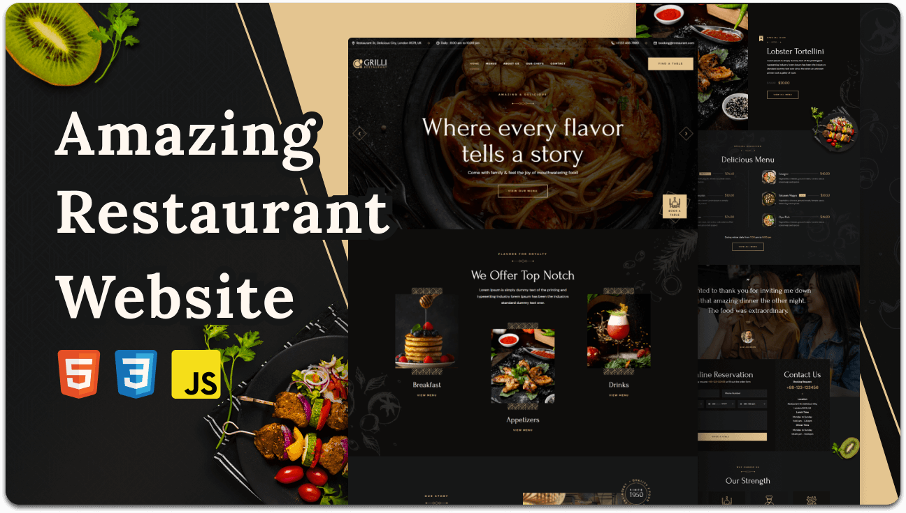

<div align="center">
  
  
  
  
[](https://twitter.com/intent/follow?screen_name=codewithsadee_)
  [](https://youtu.be/CjVGp5kGHxA)

  <br />
  <br />

  <h2 align="center">Merry Land Restaurant</h2>

  A responsive restaurant website built with Next.js, React, and TypeScript.

  The Next.js application and its required assets are in the [`frontend`](./frontend) directory.

</div>

<br />

### Demo Screeshots



### Run locally

```bash
cd frontend
npm ci
npm run dev
```

Open `http://localhost:3000`.

### Deploy to Vercel

Import this repository and set the Vercel **Root Directory** to `frontend`.
Use the Next.js framework preset and leave the Output Directory at its default.
The production build command is `npm run build`.

### Contact

If you want to contact with me you can reach me at [Twitter](https://www.twitter.com/codewithsadee).

### License

[MIT](https://choosealicense.com/licenses/mit/)
